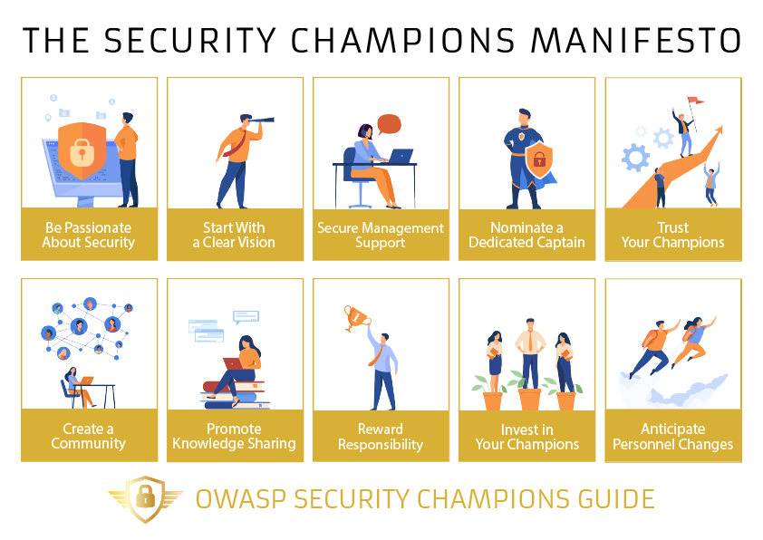

The OWASP Security Champions Manifesto is a set of guiding principles crucial to any successful program!

The principles have been drawn from an initial series of in-depth interviews with Application Security leaders from across the globe as part of our wider goal to provide a comprehensive Security Champions playbook.

<map name="image-map">
    <area target="_self" title="Be passionate about security" href="../principles/01_Be_passionate_about_security" coords="174,85,24,289" shape="rect">
    <area target="_self" title="Start with a clear vision for your program" href="../principles/02_Start_with_a_clear_vision_for_your_program" coords="184,290,335,85" shape="rect">
    <area target="_self" title="Secure management support" href="../principles/03_Secure_management_support" coords="495,86,349,288" shape="rect">
    <area target="_self" title="Nominate a dedicated captain" href="../principles/04_Nominate_a_dedicated_captain" coords="505,287,656,87" shape="rect">
    <area target="_self" title="Trust your champions" href="../principles/05_Trust_your_champions" coords="667,286,816,87" shape="rect">
    <area target="_self" title="Create a community" href="../principles/06_Create_a_community" coords="23,509,172,309" shape="rect">
    <area target="_self" title="Promote knowledge sharing" href="../principles/07_Promote_knowledge_sharing" coords="184,508,335,307" shape="rect">
    <area target="_self" title="Reward responsibility" href="../principles/08_Reward_responsibility" coords="346,507,495,308" shape="rect">
    <area target="_self" title="Invest in your champions" href="../principles/09_Invest_in_your_champions" coords="507,508,656,307" shape="rect">
    <area target="_self" title="Anticipate personnel changes" href="../principles/10_Anticipate_personnel_changes" coords="668,509,817,310" shape="rect">
</map>

## Key principles
The Ten Key Principles of a Successful Security Champions Program:

1. [Be passionate about security](principles/01_Be_passionate_about_security.md)
2. [Start with a clear vision for your program](principles/02_Start_with_a_clear_vision_for_your_program.md)
3. [Secure management support](principles/03_Secure_management_support.md)
4. [Nominate a dedicated captain](principles/04_Nominate_a_dedicated_captain.md)
5. [Trust your champions](principles/05_Trust_your_champions.md)
6. [Create a community](principles/06_Create_a_community.md)
7. [Promote knowledge sharing](principles/07_Promote_knowledge_sharing.md)
8. [Reward responsibility](principles/08_Reward_responsibility.md)
9. [Invest in your champions](principles/09_Invest_in_your_champions.md)
10. [Anticipate personnel changes](principles/10_Anticipate_personnel_changes.md)

## Visual
Download your copy of our principles infographic:
